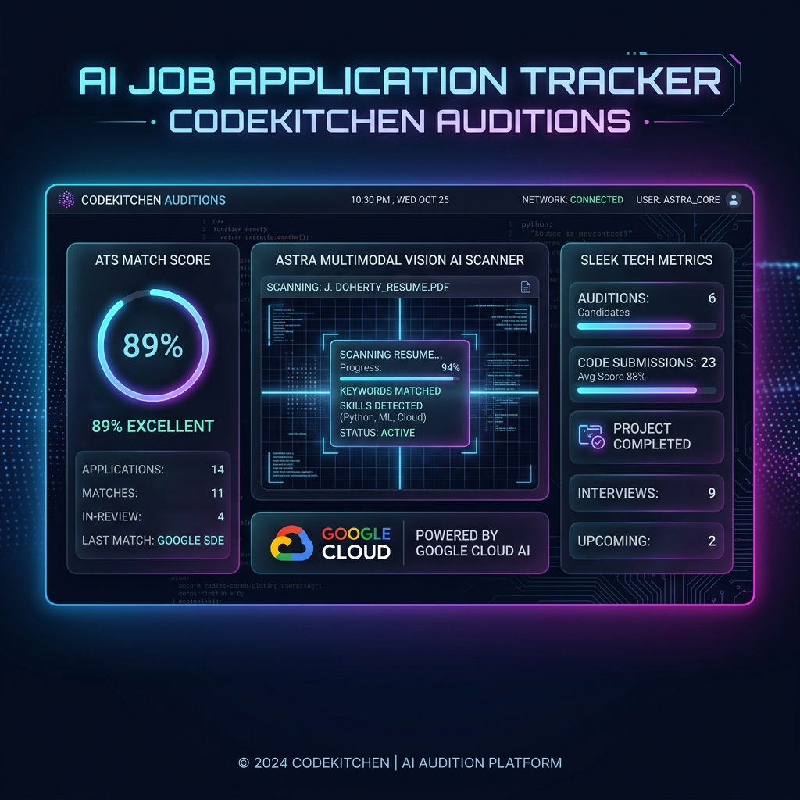
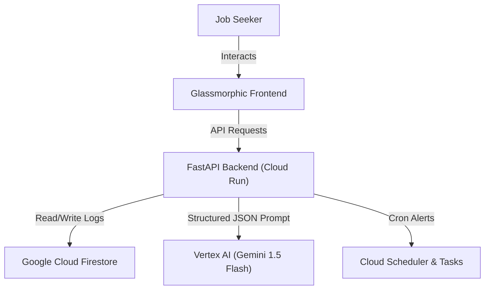

# ☁️ AI Job Application Tracker



An automated career optimization pipeline and job application dashboard built with **Python, FastAPI, Google Cloud Firestore, and Vertex AI (Gemini 1.5 Flash)**. Created for the **Google Cloud Code Kitchen** reality series auditions.

---

## ⚡ Key Features

1. **Astra Multimodal Vision AI Scanner:** Project Astra-inspired scanner using Gemini Vision to parse handwritten job posters, screenshots, and hiring flyers to auto-extract Job Title, Company, Required Skills, and Compensation.
2. **Firestore Database Integration:** Deploys as a native serverless backend storing jobs inside document collections on Google Cloud Firestore, with an automatic local SQLite fallback for local-first testing.
3. **Vertex AI Resume Analyzer:** Leverages Gemini to run semantic analysis against a candidate's resume, calculate an ATS match score, extract missing keywords, and suggest optimizations.
4. **AI Follow-up & Cold Mailer:** Instantly drafts tailored cold pitches and follow-up templates based on the specific job description and application stage.
5. **Premium Glassmorphic Interface:** A fast, responsive, and gorgeous dark-mode dashboard with real-time stats and visual funnel trackers.

---

## 🏗️ Google Cloud Architecture



---

## 🚀 Quickstart Guide

### 1. Clone & Set Up Directory
Navigate to the directory:
```bash
cd C:\Users\adiqu\.gemini\antigravity\scratch\ai-job-tracker
```

### 2. Install Dependencies
Set up your virtual environment and install packages:
```bash
python -m venv venv
source venv/Scripts/activate  # On Windows: venv\Scripts\activate
pip install -r requirements.txt
```

### 3. Configure API Keys
Create your `.env` file (already initialized in root) and set your Gemini API key and Firestore project ID:
```ini
GEMINI_API_KEY=your_gemini_api_key_from_google_ai_studio
FIRESTORE_PROJECT_ID=ai-job-tracker-kitchen
```

### 4. Run Locally
Launch the development server:
```bash
uvicorn app.main:app --reload
```
Open **`http://127.0.0.1:8000`** in your browser to view the live dashboard!

---

## ☁️ Google Cloud Deployment Instructions

To deploy the application to your pre-funded Google Cloud Sandbox:

### 1. Initialize GCP Project
```bash
gcloud init
gcloud config set project [YOUR_PROJECT_ID]
```

### 2. Build & Deploy on Cloud Run
Use Google Cloud Build to package the container and deploy it serverless:
```bash
gcloud run deploy ai-job-tracker --source . --port 8000 --allow-unauthenticated
```

---

*Made with ❤️ for the Code Kitchen Auditions.*
